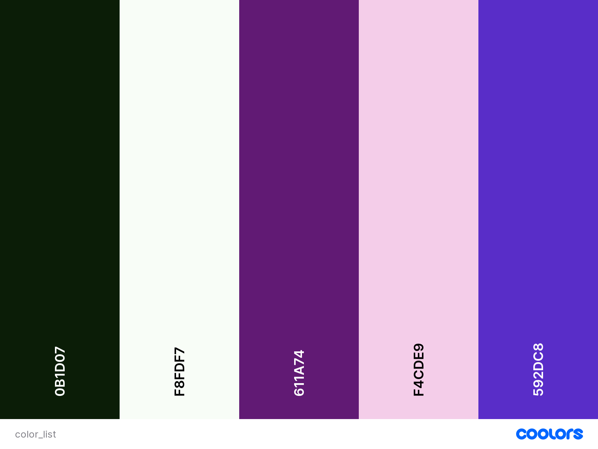
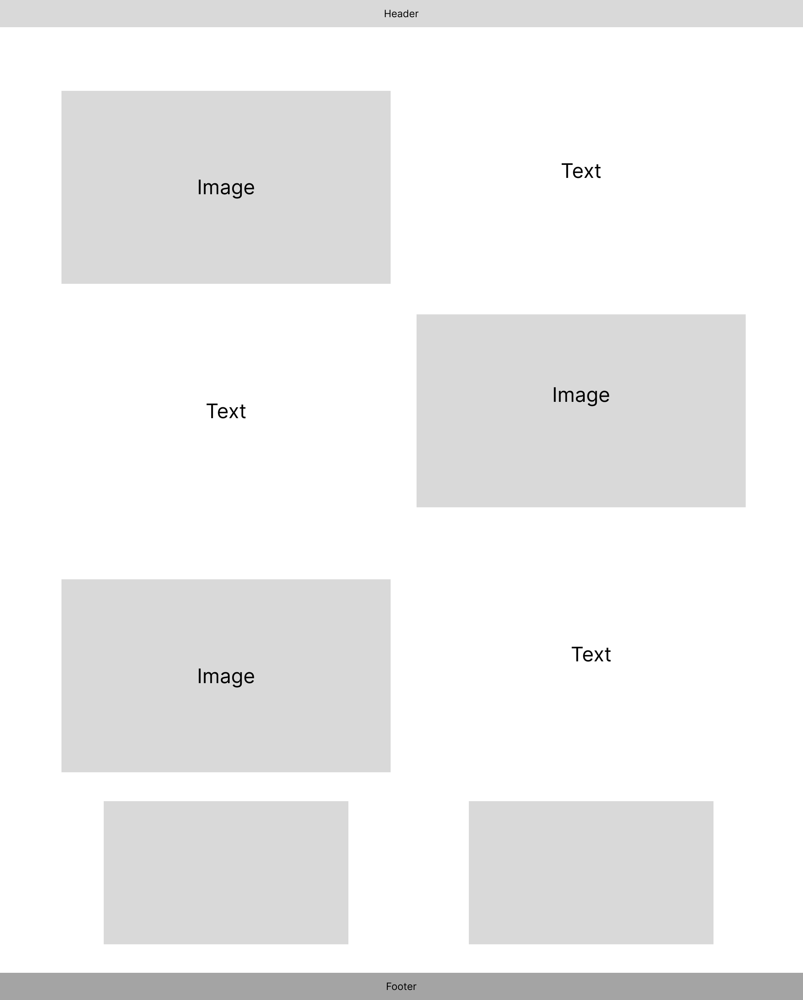
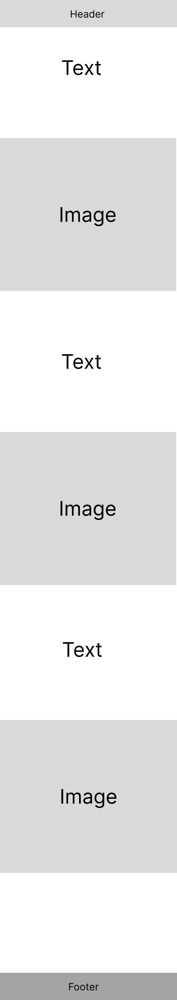
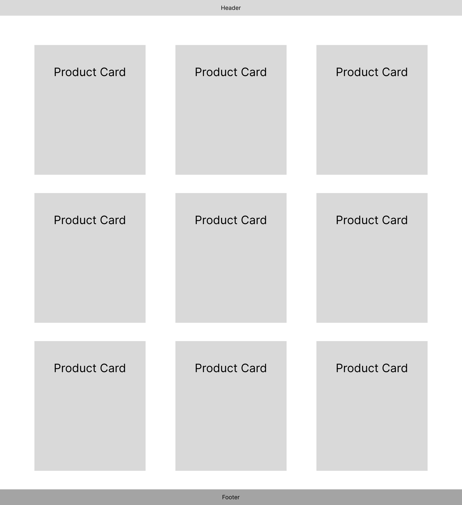
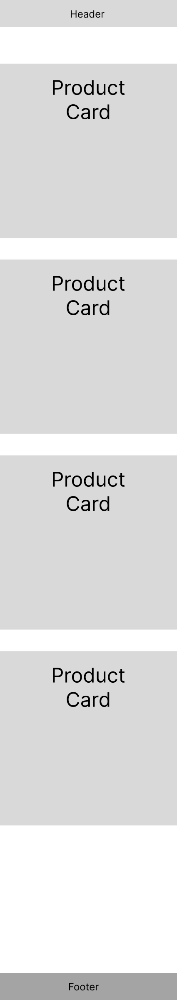
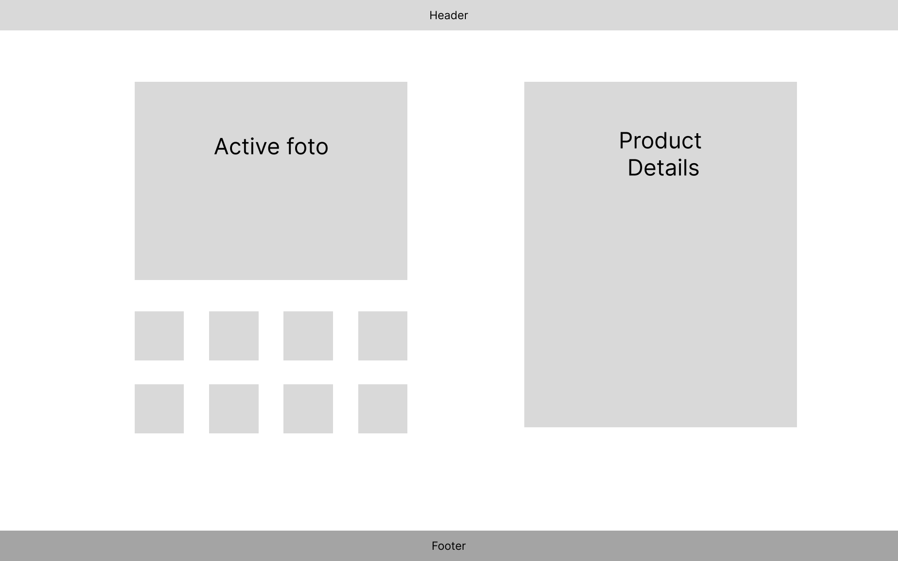
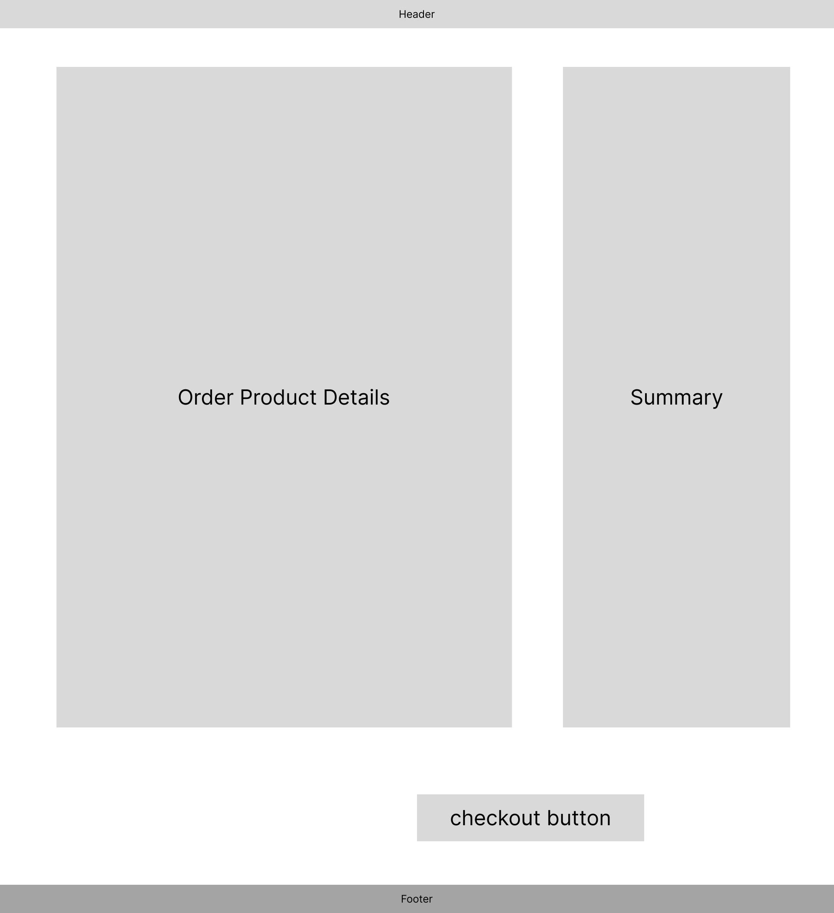
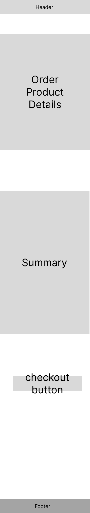
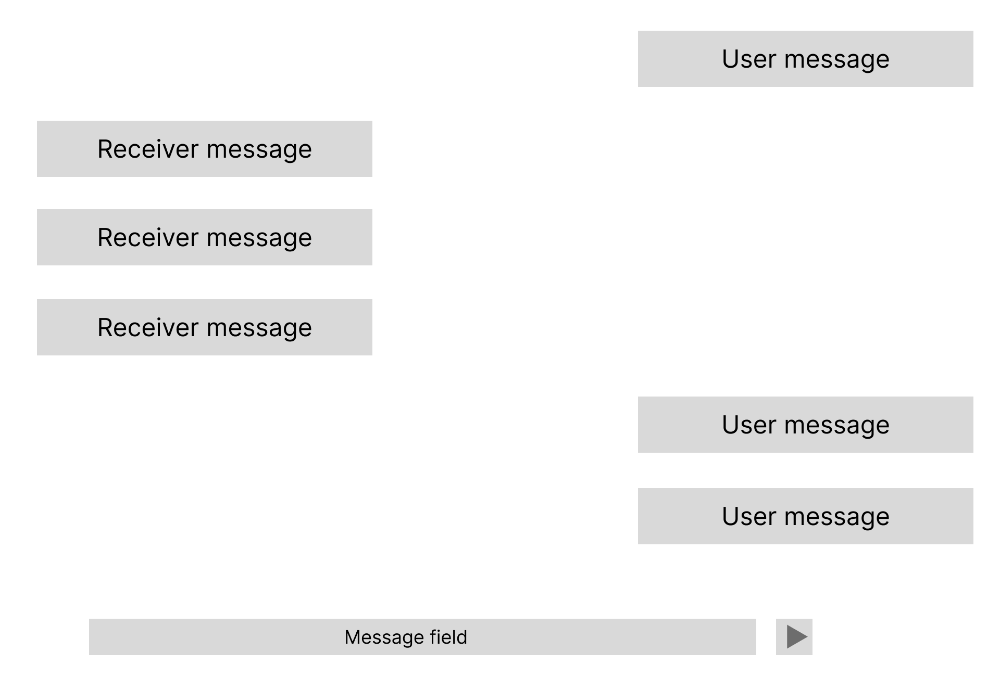
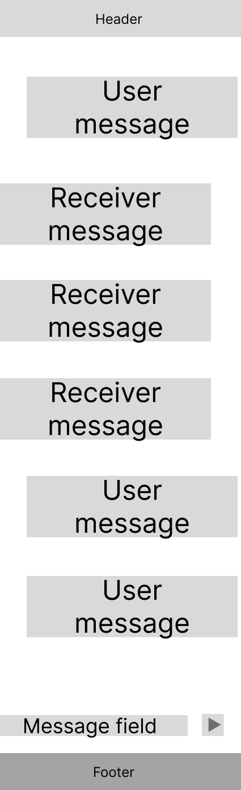

# G-mark

[View the live project here](https://milestone-project--4-cae9f77b4759.herokuapp.com/)

This is my final project for Code Institute diploma, based on full stack development of E-comerce shop.


## Author
Erikas Ramanauskas

   

---
**Table of Contents**

- [G-mark](#g-mark)
  - [Author](#author)
  - [Overview](#overview)
  - [User Stories](#user-stories)
  - [Design](#design)
    - [Colour Scheme](#colour-scheme)
    - [Typography](#typography)
    - [Imagery](#imagery)
  - [Wireframes](#wireframes)
  - [Technologies Used](#technologies-used)
      - [Designs \& Wireframes](#designs--wireframes)
      - [Additional helpers](#additional-helpers)
      - [Programming Languages](#programming-languages)
      - [Libraries \& Frameworks](#libraries--frameworks)
      - [Project Dependencies](#project-dependencies)
      - [Databases](#databases)
      - [Hosting](#hosting)
      - [Version Control](#version-control)
      - [Testing](#testing)
  - [Bugs and Solutions](#bugs-and-solutions)
    - [Solved bugs](#solved-bugs)
    - [Remaining Bugs](#remaining-bugs)
    - [Ideas and plans for improvement](#ideas-and-plans-for-improvement)
  - [Application Idea and functionality](#application-idea-and-functionality)
    - [Reasons for chosing such an aplication](#reasons-for-chosing-such-an-aplication)
    - [General choices for application](#general-choices-for-application)
    - [For anyone who is not familiar with the game](#for-anyone-who-is-not-familiar-with-the-game)
    - [Idividual page functionalities](#idividual-page-functionalities)
    - [Phyton and Jinja Chalanges:](#phyton-and-jinja-chalanges)
  - [Credits](#credits)
    - [Mentor](#mentor)
    - [Codes](#codes)
  - [Acknowledgements](#acknowledgements)
  - [Copyrights](#copyrights)

---

## Overview

Description

## User Stories

| # | User Story | User | Priority | Completed |
| :---: | :--- | :---: | :---: | :---: |
| | Visitor navigation | | | |
| --- | --- | --- | --- | --- |
| 1 | As a user I can view link to home page | Visitor | High | ✅ |
| 2 | As a user I can view link to list of men brands | Visitor | High | ✅ |
| 3 | As a user I can view link to list of men categories | Visitor | High | ✅ |
| 4 | As a user I can view link to list of men sizes | Visitor | High | ✅ |
| 5 | As a user I can view link to list of female categories | Visitor | High | ✅ |
| 6 | As a user I can view link to list of female categories | Visitor | High | ✅ |
| 7 | As a user I can view link to list of female sizes | Visitor | High | ✅ |
| 8 | As a user I can view search bar and button | Visitor | High | ✅ |
| 9 | As a user I can view link to register account | Visitor | High | ✅ |
| 10 | As a user I can view link to log in account | Visitor | High | ✅ |
| 11 | As a user I can view link to check bag | Visitor | High | ✅ |
| 12 | As a user I can view link in footer to Facebook page | Visitor | Low | ✅ |
| 13 | As a user I can view link in footer to Twitter page | Visitor | Low | ✅ |
| 14 | As a user I can view link in footer to Youtube page | Visitor | Low | ✅ |
| 15 | As a user I can view link in footer to Instagram page | Visitor | Low | ✅ |
| 16 | As a user I can view link in footer to Instagram page | Visitor | Low | ✅ |
| 17 | As a user I can press on logo to return to home page | Visitor | Low | ✅ |
| -- | --- | --- | --- | --- |
| | Registred user navigation | | | |
| --- | --- | --- | --- | --- |
| 18 | As a registed user I can view link to profile | User | High | ✅ |
| 19 | As a registed user I can view link to order history | User | High | ✅ |
| 20 | As a registed user I can view link to messages | User | High | ✅ |
| 21 | As a registed user I can view link to logout button | User | High | ✅ |
| -- | --- | --- | --- | --- |
| | Superuser navigation | | | |
| --- | --- | --- | --- | --- |
| 22 | As superuser I can view link to add product link | Superuser | High | ✅ |
| 23 | As superuser I can view link to sold products link | Superuser | Medium | ✅ |
| 24 | As superuser I can view link to superuser messages link | Superuser | Medium | ✅ |
| -- | --- | --- | --- | --- |
| | Special navigation | | | |
| --- | --- | --- | --- | --- |
| 25 | As registed user I can view ask about link within product detail page | User | Medium | ✅ |
| 26 | As superuser I can view edit product link within product detail page | Superuser | High | ✅ |
| 27 | As superuser I can view delete product link within product detail page | Superuser | High | ✅ |
| -- | --- | --- | --- | --- |
| | Product Functionalities | | | |
| --- | --- | --- | --- | --- |
| 28 | As a user I can enter all prodcuts via home hero button | Visitor | High | ✅ |
| 29 | As a user I can check product groups via home page | Visitor | High | ✅ |
| 30 | As a user I can search sprecific products within navigation bar | Visitor | High | ✅ |
| 31 | As a user I can add products to a bag | Visitor | High | ✅ |
| 32 | As a user I can see the produts that were added to a bag | Visitor | High | ✅ |
| 33 | As a user I can see individual product details | Visitor | High | ✅ |
| 34 | As a user I can remove products from my bag | Visitor | High | ✅ |
| 35 | As a registered user I can send a message to support about specific product | User | Medium | ✅ |
| -- | --- | --- | --- | --- |
| | Order Functionalities | | | |
| --- | --- | --- | --- | --- |
| 36 | As a user I can order and pay for the products I purchase | Visitor | High | ✅ |
| 37 | As a registered user I can see my order history | User | High | ✅ |
| 38 | As a registered user I can edit my profile with prefill adress | User | Medium | ✅ |
| 39 | As a registered user I can see a list of messages to suport | User | Medium | ✅ |
| -- | --- | --- | --- | --- |
| | User functionalities | | | |
| --- | --- | --- | --- | --- |
| 40 | As Visitor I can register my acount with G-mark | User | High | ✅ |
| 41 | As user I can log in to my acount | User | High | ✅ |
| 42 | As user I can log out of my account | User | High | ✅ |
| 43 | As user I can recover password of my account | User | High | ✅ |
| -- | --- | --- | --- | --- |
| | Superuser functionalities | | | |
| --- | --- | --- | --- | --- |
| 44 | As a superuser I can add new products | Superuser | High | ✅ |
| 45 | As a superuser I remove products | Superuser | High | ✅ |
| 46 | As superuser I can edit product | Superuser | High | ✅ |
| 47 | As superuser I can see all messages send by ussers to support and respond | Superuser | Medium | ✅ |
| 48 | As a superuser I can see all sold products | Superuser | Medium | ✅ |


## Design

### Colour Scheme




* As a final project for code institutre I wanted to chalange my self to try different color pallete from other project I did. (Each one of them was aimed with different colors). Personaly I enjoy purple color so by playing around and read about colors I decided it would be best choice for shoe website.

* As quick google search says: "Purple combines the calm stability of blue and the fierce energy of red"

* All other colours were generated using [Adobe colour wheal](https://color.adobe.com/create/color-wheel) text/background dark green, complementary pink, and accent blue

* I decided to leave background plain as with many diferent color components it would make the website to busy.

### Typography

- For the titles I chose Lato font.
- For main font I chose Playfair Display font
- For navigation I chose Roboto font

### Imagery

- The logo and home page pictures were generated using ai [Midjorney](https://www.midjourney.com/)

- The product images a real images I was given by my family member that sells used shoes online.

## Wireframes

* Desktop home page
* 
* Mobile home page
* 
* Desktop Product page
- 
* Mobile Product page
- 
* Desktop Product detail page
- 
* Mobile Product detail page
- 
* Checkout page
- 
* Mobile Checkout page
- 
* Message page
- 
* Mobile Message page
- 

## Technologies Used

#### Designs & Wireframes

- [Figma](https://www.figma.com/) was used to create wireframes

#### Additional helpers

- [Google sheets](https://drive.google.com/drive/folders/1Y7ppCP_ZSEwcPvLsoRQy-UTgye-nt7SS) 2 sheets have been used one to create fixtures for products [link](https://docs.google.com/spreadsheets/d/1XGZszfwDMSm3QAaGCw-CKAq7IyMX9C5NuqH43EDyHmg/edit#gid=0)  and other for readme quicker fill help [link](https://docs.google.com/spreadsheets/d/1lETe7F-Dr-HGewKOnvcKpMQIqTUxxH7jmfcz2i_WhyU/edit#gid=0)

#### Programming Languages


#### Libraries & Frameworks

- [Django](https://www.djangoproject.com/) Django was main Framework that most of aplications was used that controled all aspects of it.
- [Font Awesome](https://fontawesome.com/icons) Lots and lots of icons used though out the app
- [Google Fonts](https://fonts.google.com/) fonts used to import main fonts for the page.
- [Favicon](https://favicon.io/favicon-converter/) was used to create favicon.
- [Stripe](https://stripe.com/en-gb) Stripe used for payment systems

#### Project Dependencies

- [**ASGIRef**](https://asgi.readthedocs.io/en/latest/asgi.html): ASGI Specification Reference - A reference implementation of the ASGI specification.
- [**Black**](https://black.readthedocs.io/en/stable/): The uncompromising code formatter for Python.
- [**Boto3**](https://boto3.amazonaws.com/v1/documentation/api/latest/index.html): Amazon Web Services (AWS) SDK for Python.
- [**Botocore**](https://botocore.amazonaws.com/v1/documentation/api/latest/index.html): Low-level, core functionality of Boto3.
- [**Certifi**](https://certifi.io/): Collection of Root Certificates for SSL certificate validation.
- [**CFFI**](https://cffi.readthedocs.io/en/latest/): Foreign Function Interface for calling C code from Python.
- [**Charset-Normalizer**](https://pypi.org/project/charset-normalizer/): Library for character encoding detection and normalization.
- [**Click**](https://click.palletsprojects.com/en/8.0.x/): Package for creating beautiful command line interfaces.
- [**Colorama**](https://pypi.org/project/colorama/): Library for adding color to terminal text.
- [**Crispy-Bootstrap5**](https://django-crispy-forms.readthedocs.io/en/latest/): Django app for managing forms using Bootstrap.
- [**Cryptography**](https://cryptography.io/en/latest/): Package providing cryptographic recipes and primitives to Python developers.
- [**Defusedxml**](https://pypi.org/project/defusedxml/): Library for parsing XML and preventing various XML-based attacks.
- [**Dj-database-url**](https://pypi.org/project/dj-database-url/): Django database configuration parser.
- [**Django**](https://www.djangoproject.com/): High-level web framework for Python.
- [**Django-Allauth**](https://django-allauth.readthedocs.io/en/latest/): Integrated set of Django applications for authentication, registration, and account management.
- [**Django-Cors-Headers**](https://github.com/adamchainz/django-cors-headers): Django app for handling server headers required for Cross-Origin Resource Sharing (CORS).
- [**Django-Crispy-Forms**](https://django-crispy-forms.readthedocs.io/en/latest/): Django application for managing forms using Bootstrap.
- [**Django-Extensions**](https://django-extensions.readthedocs.io/en/latest/): Collection of custom extensions for the Django Framework.
- [**Django-Resized**](https://pypi.org/project/django-resized/): Django app for handling image uploads and resizing.
- [**Django-Storages**](https://django-storages.readthedocs.io/en/latest/): Collection of custom storage backends for Django.
- [**Django-Werkzeug-Debugger-Runserver**](https://django-extensions.readthedocs.io/en/latest/): Django extension for running the Werkzeug interactive debugger.
- [**Gunicorn**](https://gunicorn.org/): Python WSGI HTTP server for UNIX.
- [**Idna**](https://pypi.org/project/idna/): Library for Internationalized Domain Names in Applications (IDNA).
- [**Jmespath**](https://pypi.org/project/jmespath/): Query language for JSON.
- [**MarkupSafe**](https://pypi.org/project/MarkupSafe/): Library for building web templates.
- [**Mypy-Extensions**](https://pypi.org/project/mypy-extensions/): Extensions to the standard 'typing' module.
- [**Oauthlib**](https://oauthlib.readthedocs.io/en/latest/): Generic and reusable Python implementation of OAuth1 and OAuth2.
- [**Packaging**](https://pypi.org/project/packaging/): Core utilities for Python packages.
- [**Pathspec**](https://pathspec.readthedocs.io/en/latest/): Utility library for Git pathspec matching.
- [**Pillow**](https://pillow.readthedocs.io/en/stable/): Powerful library for opening, manipulating, and saving many different image file formats.
- [**Platformdirs**](https://pypi.org/project/platformdirs/): Small library to find platform-specific dirs.
- [**Psycopg2**](https://www.psycopg.org/): PostgreSQL adapter for Python.
- [**Pycparser**](https://pypi.org/project/pycparser/): Complete parser of the C language.
- [**PyJWT**](https://pyjwt.readthedocs.io/en/stable/): Python library for encoding and decoding JSON Web Tokens.
- [**PyOpenSSL**](https://pyopenssl.org/): Python wrapper for OpenSSL.
- [**Python-Dateutil**](https://dateutil.readthedocs.io/en/stable/): Extensions to the standard Python datetime module.
- [**Python3-Openid**](https://pypi.org/project/python3-openid/): Python OpenID library.
- [**Requests**](https://docs.python-requests.org/en/latest/): Simple HTTP library for Python.
- [**Requests-Oauthlib**](https://requests-oauthlib.readthedocs.io/en/latest/): OAuthlib authentication support for Requests.
- [**S3transfer**](https://pypi.org/project/s3transfer/): Python library for Amazon S3.
- [**Six**](https://pypi.org/project/six/): Python 2 and 3 compatibility library.
- [**Sqlparse**](https://pypi.org/project/sqlparse/): Non-validating SQL parser module for Python.
- [**Stripe**](https://stripe.com/docs/api): Python client for the Stripe API.
- [**Typing-Extensions**](https://pypi.org/project/typing-extensions/): Backported and experimental type hints for Python 3.5 and 3.6.
- [**Tzdata**](https://data.iana.org/time-zones/tzdb-2023c/): IANA Time Zone Database.
- [**Urllib3**](https://urllib3.readthedocs.io/en/latest/): Powerful HTTP library for Python.
- [**Werkzeug**](https://werkzeug.palletsprojects.com/en/3.0.x/): Comprehensive WSGI web application library.

#### Databases

- [Elephant SQL](https://www.elephantsql.com/)

#### Hosting

- [GitHub Pages](https://github.com/)
- [Heroku](https://id.heroku.com/)
- [AWS](https://aws.amazon.com/free/)

#### Version Control

[Git](https://git-scm.com/) was used for version control.
[Visual studio code](https://code.visualstudio.com/) Used for all coding and testing. I chose to sort out my vscode local server and focus programing in local IDE, as Gitpod or Codeanywere provided to much additional complications during my 3rd project to be worth it.
[GitHub](https://github.com/) Was and is being used as repository of the project source code and for deploying the site/ application.

#### Testing

- [Chrome DevTools](https://developer.chrome.com/docs/devtools/) was used to test the code and debug the code during the development process.
- [W3C Markup](https://validator.w3.org/) Validation was used to test HTML code
- [W3C CSS](https://jigsaw.w3.org/css-validator/) Validation Service was used to test CSS code


## Bugs and Solutions

### Solved bugs

* During the development of of product models I have decided early that I wanted to include more than one picture per product. 
This lead me in to looking for the ways to creating array of values. Due to my precious project usign mongoDB non relational database I was more fmailiar with filling one of paramaters with an array and completley missed ManyToManyField field functionality. Instead I found ArrayField that is exlusively used by postgresssql. This lead me doing my models and fixutres around that and preventing me from using local sql database.

However once iparticipated in Live london hackaton, we used django and my team explained my mistake and lead me the right path. I had to rework some of my code and research further how to I can attach all photos as separate model.

* During the development of men and women shoe dropdown I wanted to make dinamic size dropdown depending on how many categories and brands showing up (sizes were aded after I solve all bugs). One issue with it that the the sectiins were either climbing on top of each other or going out side of the screen. Later I figured out that due to dinamic data passed there we no static measurment of any form thus any dinamic measurments given were completley off. At the end I just made it so it would of maximum 16 values in the column and jump over to next as well as static number of width.

* secondly my goal for men and womens shoe meniu is to filter out every product that belongs to men and women within database and only show brands, and categories that has at least one product. At the begining I succsseded just filtering cattegories or brands but when I had to do sepparate men and women I was recieving no data. I asked help for fellow student and [Pavlo Myskov](https://github.com/FlashDrag) helped me out with filtering and indetified that I was trying to filter for "Men" when my fixtures were set to "m". 

* Another bug that took some time to figure out was superuser message save. When user sends any message it is saved on users size, however when superuser send it, it suposed to save superuser "true", however it would not and instead would load new chat that I did not intend to. This I solved with a litle help from london comuntiry as value was saved at the wrong location.

*Multitude of other smaller bugs faced with css, type, certain functionalities. But nothing madjor that took research or additional help to solve.


### Remaining Bugs

* Still need to work on changing the individual picture or multiple pictures from the product as current functionality only alows to add multiple pictures at the creation of product and replace them with brand new ones but not change them individualy


### Ideas and plans for improvement

* I would love to add additional check before checkout offering shoe care protection kito or other similar product. Maybe even based on the type of shoes person is buying. Idea woudl be to upsell additional product before user checks out.

* Additiona lcategory and filtered meniu could be added for children

* Instead of hero images a lot of online shops have featured section, usualy a carousel. Similar thing could be implemented to promote different product on a front page. 


## Application Idea and functionality

### Reasons for chosing such an aplication

* As a final project based on Django ecomerce, the choice was limited to mostly selling products. Since my cousins sell Used shoes online, I asked for their pictures as dumy database. And based project aroudn shoe shop

* I believe most of the the online shops functionality is similart ot boutique ado as all the products are consitent, SOeme will have certain stock. However used items always change over, so certain functionalities like a stock or different sizes should be treated in different ways.

### General choices for application

* Due to products always changing and certain categories or brands may not have a single product at any particular moment. The decition was to add products to context processors and generate the navigation based off current products. 
Example if "PUMA" brand is created but no product of that type exist within Unsold products "Puma" brand would not show up on men or women dropdown list. Same goes for type of shoes and sizes.

* For product page since only one item each is avialable i did not added multiple item purchase and just add to cart button.
* A small section openign up for adding product was insipred by Awmay.com 
* An abbility to message to superuser "support" is added for individual products. So the visitor can ask questions. I felt since it is used products, publicly asked questions would not be well recieved and individual would be better.

## Deployment 

### ElephantSQL
1. Login to ElephantSQL, access the dashboard and create a new instance (input a name, choose tiny turtle, select a region).
2. Return to the dashcoard, copy the URL.

### Heroku
3. Create a new app in Heroku, choose a unique name and region.
4. Go to settings and add a new config var of ``` DATABASE_URL ```python with the value of the URL from ElephantSQL.
5. Add host name of the Heroku app name to ALLOWED HOSTS in settings.py:

```python
ALLOWED_HOSTS = ['{heroku deployed site URL here}', 'localhost' ]
```

### GitHub/GitPod/Vscode
6. Create a new repository on GitHub, open a new workspace with GitPod / codeanywere or download to your computer.
7. After runing repository on your chosen platform, run ``` pip install -r requirements.txt ``` comand to install all requirements.
8. Rename env_sample.py (or copy) to env.py, fill all requirements keys and paswords to run local server
9. Create a new project and run the server to see if the app has installed.
10. Run migrations, create a super-user with a username, email and password. 


11. Add, commit and push to GitHub.
12. Go to Heroku, add ```DISABLE_COLLECT_STATIC = 1``` to Heroku config vars.
13. Connect the project to the GitHub repository using personal account login.
14. Go to settings in Heroku and perform a manual deployment.
15. Go to Heroku settings, enable automatic deployments.
16. Setup AWS S3 bucket (these settings might change since time of writing these instructions).

### Product fixtures

* Fixtures would need to be loaded in almoast any order with an exception of "Product" being second last, and "Picture" being last

## Credits

### Mentor

* Gareth was fenomenal in helping and advicing on my creativity plan and gave helpfull tips and inspiration with this project. Masive thank-you to him

### Codes

* Credit to [Jonas Schmedtmann](https://www.udemy.com/user/jonasschmedtmann/) udemy Course that I learned midjority of javascript before starting Code institute course. Crash course build my JS confidence It helped me a lot in a previous project and current project a lot.

* Credit and thanks to numerous tutorials on YouTube by seasoned developers.
  * Thanks to [Web Dev Simplified](https://www.youtube.com/@WebDevSimplified) for a number of code lessons in various topics;
  * Thanks to [Kevin Powell](https://www.youtube.com/@KevinPowell) for a number of code lessons in various nainly CSS designs that I learned for this and previous project;
  
* Also Credit to mentor [Dee](https://www.youtube.com/@IonaFrisbee), who created awesome series of videos doing django project that I took several ideas and inspirations form.
  

## Copyrights

[Erikas Ramanauskas, 2024](https://www.linkedin.com/in/erikas-ramanauskas)

Visit [TESTING.md](TESTING.md)
