# G-Mark -  Testing Documentation

Visit the deployed site: [View the live project here](https://milestone-project--4-cae9f77b4759.herokuapp.com/)

- - -

## CONTENTS

- [G-Mark -  Testing Documentation](#g-mark----testing-documentation)
  - [CONTENTS](#contents)
  - [Testing](#testing)
  - [AUTOMATED TESTING](#automated-testing)
    - [Validation Results](#validation-results)
    - [Lighthouse Test Results](#lighthouse-test-results)
    - [Django Coverage](#django-coverage)
  - [MANUAL TESTING](#manual-testing)
    - [Full Testing by developer](#full-testing-by-developer)
    - [Website interaction testing](#website-interaction-testing)
  - [3rd party testing during development](#3rd-party-testing-during-development)
  - [3rd party Blind Testing](#3rd-party-blind-testing)

## Testing

Testing was carried out at every point in the development to check for issues with the code, responsiveness, design, interactivity and accessibility. The developer tools used primarily were Chrome DevTools, with the console and terminal playing a key factor in testing and debugging.

Each page has been inspected using google chrome developer tools and lighthouse Firefox inspector tool to ensure that each page is fully responsive on a variety of different screen sizes and devices. I also physicaly tested the webiste on the Iphone 12, Ipad air, Macbook and Pc computers.

## AUTOMATED TESTING

### Validation Results

* The W3C Markup Validator and the W3C CSS Validator were used to test and validate every page of
the G-Mark interactive project to ensure that there were no syntax errors in the code. Chrome's
Lighthouse DevTool was also used to test for Performance, Accessibility, Best Practices and SEO.
JSHint was used to test JavaScript code quality.

* The main info on html Validator thowing info messages on *Trailing slash on void elements* due to /> close tag being added automaticaly by *prettier* and manualy removing it will be added next time the file is saved.

### Lighthouse Test Results

* Desktop - Home
* 
* Desktop - Bag
* 
* Desktop - Message
* 
* Desktop - Message List
* 
* Desktop - Checkout
* 
* Desktop - Checkout Sucsess
* 
* Desktop - Add Produt
* 
* Desktop - Edit Product
* 
* Desktop - Product Details
* 
* Desktop - Products
* 
* Desktop - Quality
* 
* Desktop - Sold Products
* 
* Desktop - Profile
* 
* Desktop - Order List
* 

* Mobile - Home
* 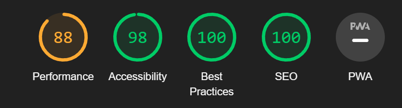
* Mobile - Bag
* 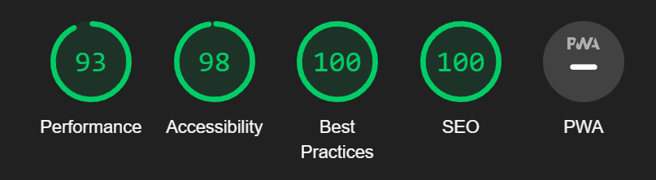
* Mobile - Message
* 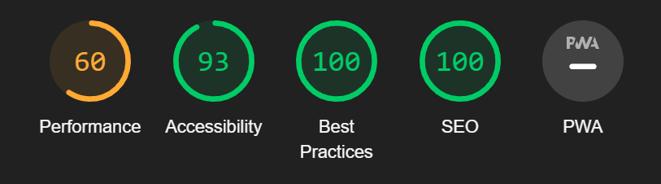
* Mobile - Message List
* 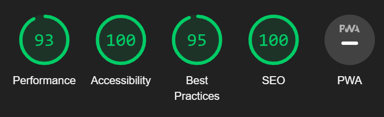
* Mobile - Checkout
* 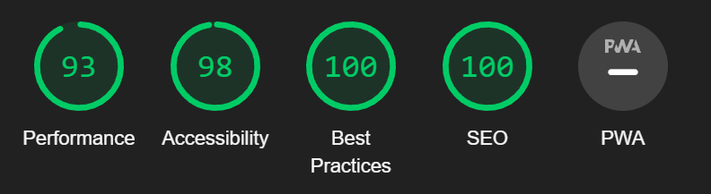
* Mobile - Checkout Sucsess
* 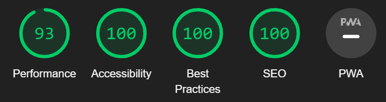
* Mobile - Add Produt
* 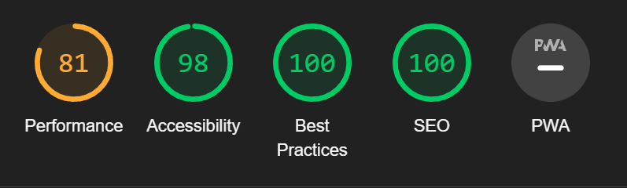
* Mobile - Edit Product
* 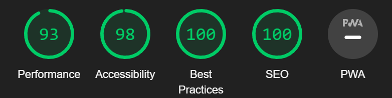
* Mobile - Product Details
* 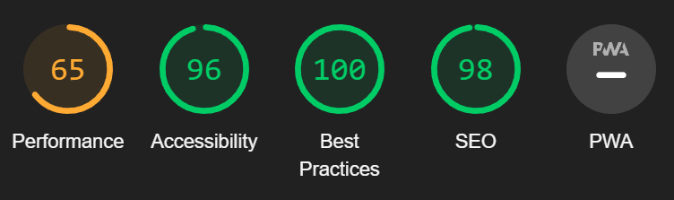
* Mobile - Products
* 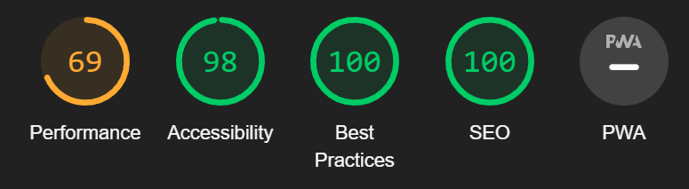
* Mobile - Quality
* 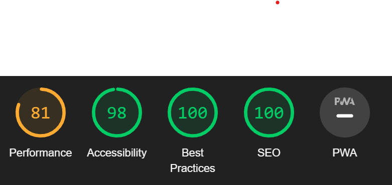
* Mobile - Sold Products
* 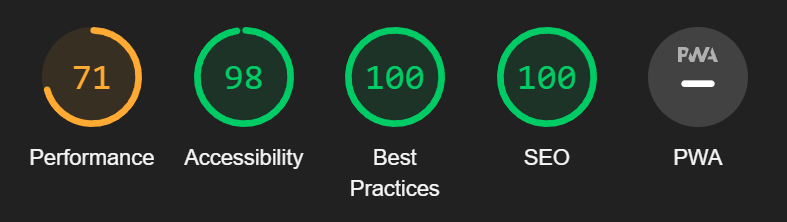
* Mobile - Profile
* 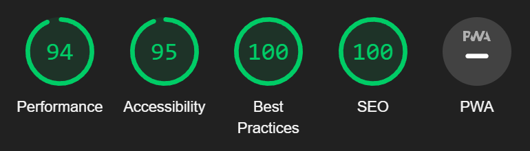
* Mobile - Order List
* 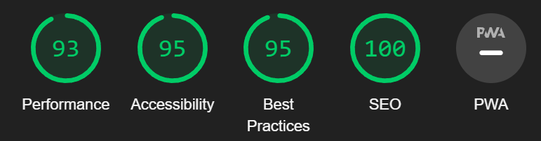

### Django Coverage

- Some of the tests were run using django integrated test setup. Additionaly coverage helped with achieving better results.
- only "Producsts" python files were tested but not all functionalities sucsessfull. 

* Coverage test
* 

## MANUAL TESTING

### Full Testing by developer

Full testing was performed on the following devices:

* Laptop:
  * Windows 11 2021 15 inch screen
    * Google Chrome
    * Safari
    * Firefox
    * Opera
    * OperaGX
  
* Mobile Devices:
  * iPhone 12 pro.
  * iPhone 14 pro.
    * Safari

### Website interaction testing

| # | Feature | Test performed | Expected outcome | Pass/Fail |
| :---: | :--- | :---: | :---: | :---: |
| | Not loged in navigation | | | |
| --- | --- | --- | --- | --- |
| 1 | Navigation logo link | Click on logo | Redirected to home page | ✅ |
| 2 | Navigation link to men's shoes | Click link | Men's brands, categories, and sizes shown in dropdown | ✅ |
| 3 | Navigation link to women's shoes | Click link | Women's brands, categories, and sizes shown in dropdown | ✅ |
| 4 | Enter All Products via Home Hero Button | Click link | All products should be accessible from the home page | ✅ |
| 5 | Check Product Groups via Home Page | Click link | Product groups should be accessible | ✅ |
| 6 | Search for Specific Products within Navigation Bar | Use the search bar | Search results for the specific product should be displayed | ✅ |
| 7 | Add Products to Bag | Add a product | Product should be added to the user's bag | ✅ |
| 8 | See Products Added to Bag | View the contents | Products in the bag should be visible | ✅ |
| 9 | See Individual Product Details | Click on | Product details page should be accessible | ✅ |
| 10 | Remove Products from Bag | Remove a product | Product should be removed from the user's bag | ✅ |
| 11 | Order and Pay for Products | Proceed to checkout | Order should be successfully placed and payment processed | ✅ |
| 12 | See Order History | User's order history should be accessible | ✅ |
| 13 | Edit Profile with Pre-filled Address | Edit the profile | Profile should be successfully updated with the new address | ✅ |
| 14 | Register Account with G-mark | Complete the registration process | User should be successfully registered with G-mark | ✅ |
| 15 | Log In to Account | Log in with valid credentials | User should be successfully logged in | ✅ |
| 16 | Log Out of Account | Log out of the account | User should be successfully logged out | ✅ |
| 17 | Recover Password of Account | Initiate password recovery process | User should receive instructions to recover the password | ✅ |
| 18 | Link in Footer to Facebook Page | Click on link | Redirected to Facebook page | ✅ |
| 19 | Link in Footer to Instagram Page | Click on link | Redirected to Instagram page | ✅ |
| 20 | Link in Footer to Twitter Page | Click on link | Redirected to Twitter page | ✅ |
| 21 | Link in Footer to LinkedIn Page | Click on link | Redirected to LinkedIn page | ✅ |
| 22 | Link in Footer to YouTube Page | Click on link | Redirected to YouTube page | ✅ |
| -- | --- | --- | --- | --- |
| | Loged in user | | | |
| --- | --- | --- | --- | --- |
| 23 | Link to Profile | Click link | User's profile page should be accessible | ✅ |
| 24 | Link to Order History | Click link | User's order history page should be accessible | ✅ |
| 25 | Link to Messages | Click link | User's messages page should be accessible | ✅ |
| 26 | Link to Logout Button | Click link | User should be able to log out | ✅ |
| 27 | ""Ask About"" Link within Product Detail Page | Click link | Leads directly to message to support | ✅ |
| 28 | See List of Messages to Support | View the list of messages | User should see a list of messages sent to support | ✅ |
| -- | --- | --- | --- | --- |
| | Superuser | | | |
| --- | --- | --- | --- | --- |
| 29 | Link to Add Product | Click link | Add product page should be accessible | ✅ |
| 30 | Link to Sold Products | Click link | Sold products page should be accessible | ✅ |
| 31 | Link to Superuser Messages | Click link | Superuser messages page should be accessible | ✅ |
| 32 | ""Edit Product"" Link within Product Detail Page | Click link | ""Edit product"" link should be visible | ✅ |
| 33 | ""Delete Product"" Link within Product Detail Page | Click link | ""Delete product"" link should be visible | ✅ |
| 34 | Add New Products | Add a new product | New product should be successfully added | ✅ |
| 35 | Remove Products | Remove a product | Product should be successfully removed | ✅ |

## 3rd party testing during development

* Performed by selected individuals who were awere of my development plan to give a feadback of user expirence.

* My brother Kris - Tested product shoping, 
* Friend Algis - Advised on design details
* Friend Lukas - Tested overal functionality
* Code insitute student Mia - advised on product page.

## 3rd party Blind Testing

* Perfomed at least 30 min testing by people who never seen the website/aplication and were given no prior information to what it is about.

* Viktoria - Loved the colors, disliked the pictures were not even
* Adam - Found clear to use, natural places for buttons.
* Irma - Found small visual bug. 
* Olegas - Liked a project

Back to [README.md](README.md)