# G-Mark -  Testing Documentation
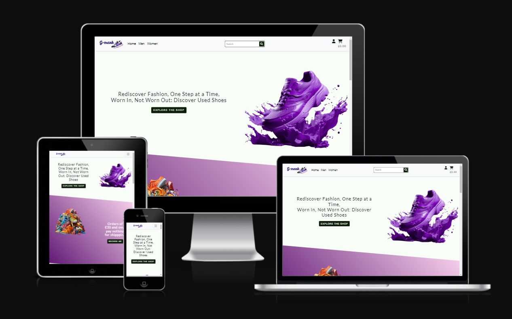

Visit the deployed site: [View the live project here](https://milestone-project--4-cae9f77b4759.herokuapp.com/)

- - -

## CONTENTS

- [G-Mark -  Testing Documentation](#g-mark----testing-documentation)
  - [CONTENTS](#contents)
  - [Testing](#testing)
  - [AUTOMATED TESTING](#automated-testing)
    - [Validation Results](#validation-results)
    - [Lighthouse Test Results](#lighthouse-test-results)
    - [Django Coverage](#django-coverage)
  - [MANUAL TESTING](#manual-testing)
    - [Full Testing by developer](#full-testing-by-developer)
    - [Website interaction testing](#website-interaction-testing)
  - [3rd party testing during development](#3rd-party-testing-during-development)
  - [3rd party Blind Testing](#3rd-party-blind-testing)

## Testing

Testing was carried out at every point in the development to check for issues with the code, responsiveness, design, interactivity and accessibility. The developer tools used primarily were Chrome DevTools, with the console and terminal playing a key factor in testing and debugging.

Each page has been inspected using google chrome developer tools and lighthouse Firefox inspector tool to ensure that each page is fully responsive on a variety of different screen sizes and devices. I also physicaly tested the webiste on the Iphone 12, Ipad air, Macbook and Pc computers.

## AUTOMATED TESTING

### Validation Results

* The W3C Markup Validator and the W3C CSS Validator were used to test and validate every page of
the G-Mark interactive project to ensure that there were no syntax errors in the code. Chrome's
Lighthouse DevTool was also used to test for Performance, Accessibility, Best Practices and SEO.
JSHint was used to test JavaScript code quality.

* The main info on html Validator thowing info messages on *Trailing slash on void elements* due to /> close tag being added automaticaly by *prettier* and manualy removing it will be added next time the file is saved.

### Lighthouse Test Results

* Desktop - Home
* 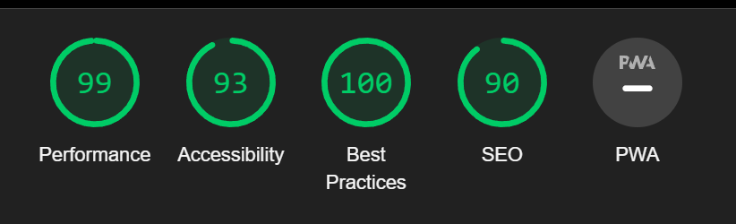
* Desktop - Bag
* 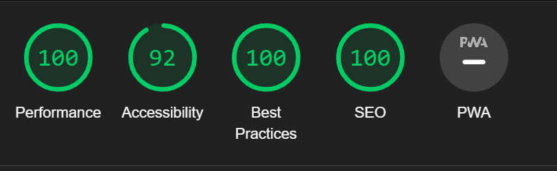
* Desktop - Message
* 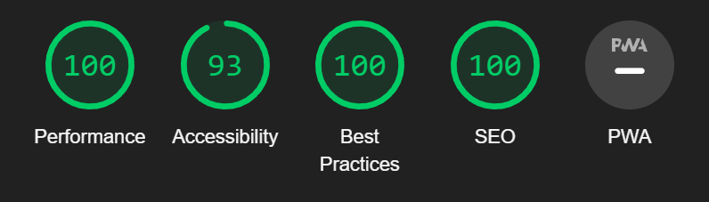
* Desktop - Message List
* 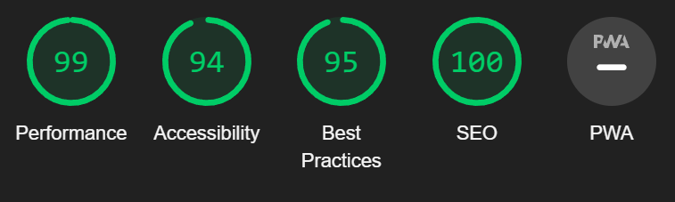
* Desktop - Checkout
* 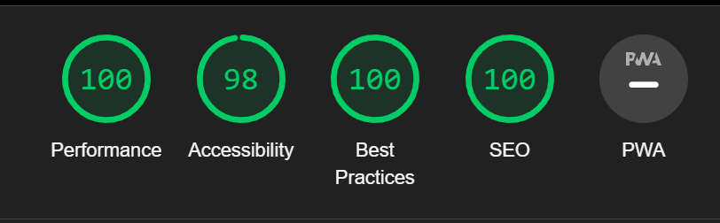
* Desktop - Checkout Sucsess
* 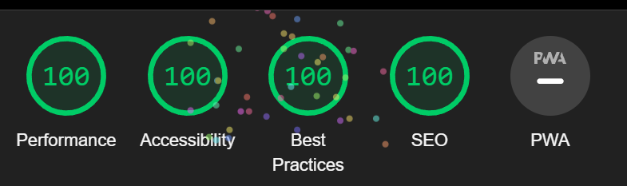
* Desktop - Add Produt
* 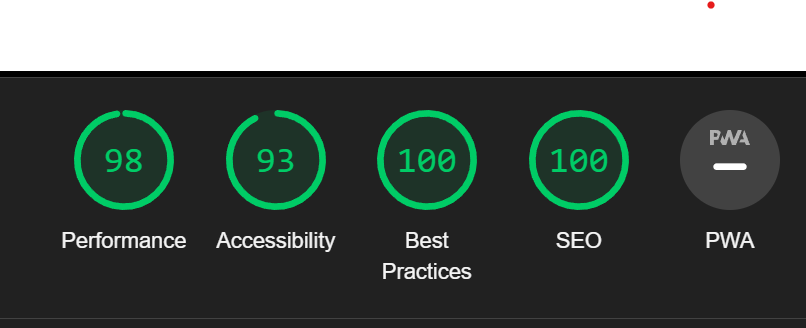
* Desktop - Edit Product
* 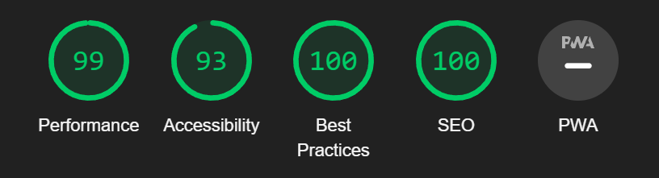
* Desktop - Product Details
* 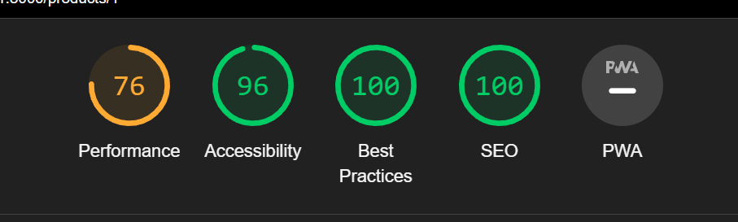
* Desktop - Products
* 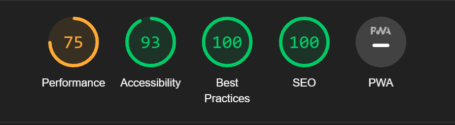
* Desktop - Quality
* 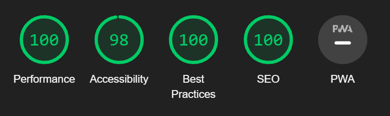
* Desktop - Sold Products
* 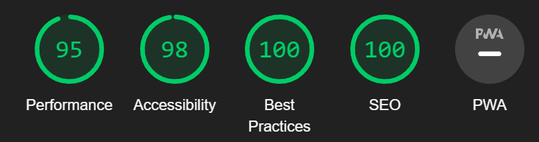
* Desktop - Profile
* 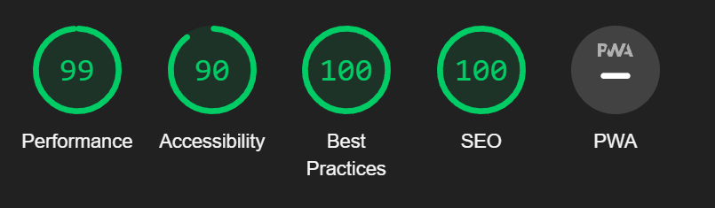
* Desktop - Order List
* 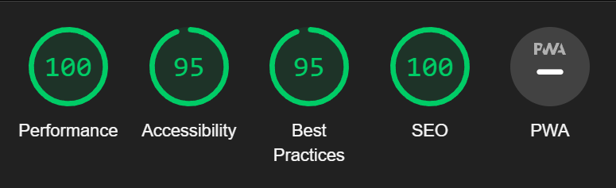

* Mobile - Home
* 
* Mobile - Bag
* 
* Mobile - Message
* 
* Mobile - Message List
* 
* Mobile - Checkout
* 
* Mobile - Checkout Sucsess
* 
* Mobile - Add Produt
* 
* Mobile - Edit Product
* 
* Mobile - Product Details
* 
* Mobile - Products
* 
* Mobile - Quality
* 
* Mobile - Sold Products
* 
* Mobile - Profile
* 
* Mobile - Order List
* 

### Django Coverage

- Some of the tests were run using django integrated test setup. Additionaly coverage helped with achieving better results.
- only "Producsts" python files were tested but not all functionalities sucsessfull. 

* Coverage test
* 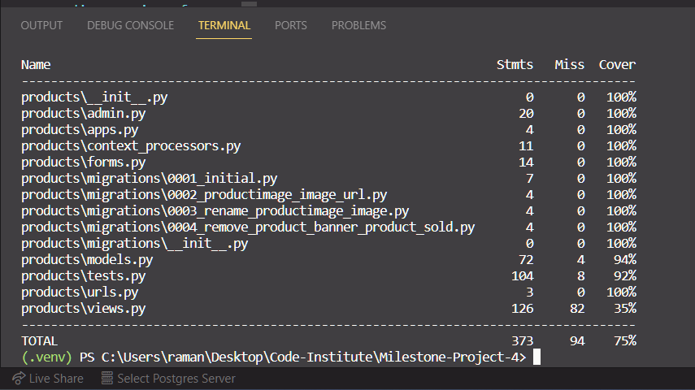

## MANUAL TESTING

### Full Testing by developer

Full testing was performed on the following devices:

* Laptop:
  * Windows 11 2021 15 inch screen
    * Google Chrome
    * Safari
    * Firefox
    * Opera
    * OperaGX
  
* Mobile Devices:
  * iPhone 12 pro.
  * iPhone 14 pro.
    * Safari

### Website interaction testing

| # | User Story | User | Priority | Completed |
| :---: | :--- | :---: | :---: | :---: |
| | Visitor navigation | | | |
| --- | --- | --- | --- | --- |
| 1 | As a user I can view link to home page | Visitor | High | ✅ |
| 2 | As a user I can view link to list of men brands | Visitor | High | ✅ |
| 3 | As a user I can view link to list of men categories | Visitor | High | ✅ |
| 4 | As a user I can view link to list of men sizes | Visitor | High | ✅ |
| 5 | As a user I can view link to list of female categories | Visitor | High | ✅ |
| 6 | As a user I can view link to list of female categories | Visitor | High | ✅ |
| 7 | As a user I can view link to list of female sizes | Visitor | High | ✅ |
| 8 | As a user I can view search bar and button | Visitor | High | ✅ |
| 9 | As a user I can view link to register account | Visitor | High | ✅ |
| 10 | As a user I can view link to log in account | Visitor | High | ✅ |
| 11 | As a user I can view link to check bag | Visitor | High | ✅ |
| 12 | As a user I can view link in footer to Facebook page | Visitor | Low | ✅ |
| 13 | As a user I can view link in footer to Twitter page | Visitor | Low | ✅ |
| 14 | As a user I can view link in footer to Youtube page | Visitor | Low | ✅ |
| 15 | As a user I can view link in footer to Instagram page | Visitor | Low | ✅ |
| 16 | As a user I can view link in footer to Instagram page | Visitor | Low | ✅ |
| 17 | As a user I can press on logo to return to home page | Visitor | Low | ✅ |
| -- | --- | --- | --- | --- |
| | Registred user navigation | | | |
| --- | --- | --- | --- | --- |
| 18 | As a registed user I can view link to profile | User | High | ✅ |
| 19 | As a registed user I can view link to order history | User | High | ✅ |
| 20 | As a registed user I can view link to messages | User | High | ✅ |
| 21 | As a registed user I can view link to logout button | User | High | ✅ |
| -- | --- | --- | --- | --- |
| | Superuser navigation | | | |
| --- | --- | --- | --- | --- |
| 22 | As superuser I can view link to add product link | Superuser | High | ✅ |
| 23 | As superuser I can view link to sold products link | Superuser | Medium | ✅ |
| 24 | As superuser I can view link to superuser messages link | Superuser | Medium | ✅ |
| -- | --- | --- | --- | --- |
| | Special navigation | | | |
| --- | --- | --- | --- | --- |
| 25 | As registed user I can view ask about link within product detail page | User | Medium | ✅ |
| 26 | As superuser I can view edit product link within product detail page | Superuser | High | ✅ |
| 27 | As superuser I can view delete product link within product detail page | Superuser | High | ✅ |
| -- | --- | --- | --- | --- |
| | Product Functionalities | | | |
| --- | --- | --- | --- | --- |
| 28 | As a user I can enter all prodcuts via home hero button | Visitor | High | ✅ |
| 29 | As a user I can check product groups via home page | Visitor | High | ✅ |
| 30 | As a user I can search sprecific products within navigation bar | Visitor | High | ✅ |
| 31 | As a user I can add products to a bag | Visitor | High | ✅ |
| 32 | As a user I can see the produts that were added to a bag | Visitor | High | ✅ |
| 33 | As a user I can see individual product details | Visitor | High | ✅ |
| 34 | As a user I can remove products from my bag | Visitor | High | ✅ |
| 35 | As a registered user I can send a message to support about specific product | User | Medium | ✅ |
| -- | --- | --- | --- | --- |
| | Order Functionalities | | | |
| --- | --- | --- | --- | --- |
| 36 | As a user I can order and pay for the products I purchase | Visitor | High | ✅ |
| 37 | As a registered user I can see my order history | User | High | ✅ |
| 38 | As a registered user I can edit my profile with prefill adress | User | Medium | ✅ |
| 39 | As a registered user I can see a list of messages to suport | User | Medium | ✅ |
| -- | --- | --- | --- | --- |
| | User functionalities | | | |
| --- | --- | --- | --- | --- |
| 40 | As Visitor I can register my acount with G-mark | User | High | ✅ |
| 41 | As user I can log in to my acount | User | High | ✅ |
| 42 | As user I can log out of my account | User | High | ✅ |
| 43 | As user I can recover password of my account | User | High | ✅ |
| -- | --- | --- | --- | --- |
| | Superuser functionalities | | | |
| --- | --- | --- | --- | --- |
| 44 | As a superuser I can add new products | Superuser | High | ✅ |
| 45 | As a superuser I remove products | Superuser | High | ✅ |
| 46 | As superuser I can edit product | Superuser | High | ✅ |
| 47 | As superuser I can see all messages send by ussers to support and respond | Superuser | Medium | ✅ |
| 48 | As a superuser I can see all sold products | Superuser | Medium | ✅ |

## 3rd party testing during development

* Performed by selected individuals who were awere of my development plan to give a feadback of user expirence.

* My brother Kris - Tested product shoping, 
* Friend Algis - Advised on design details
* Friend Lukas - Tested overal functionality
* Code insitute student Mia - advised on product page.

## 3rd party Blind Testing

* Perfomed at least 30 min testing by people who never seen the website/aplication and were given no prior information to what it is about.

* Viktoria - Loved the colors, disliked the pictures were not even
* Adam - Found clear to use, natural places for buttons.
* Irma - Found small visual bug. 
* Olegas - Liked a project

Back to [README.md](README.md)